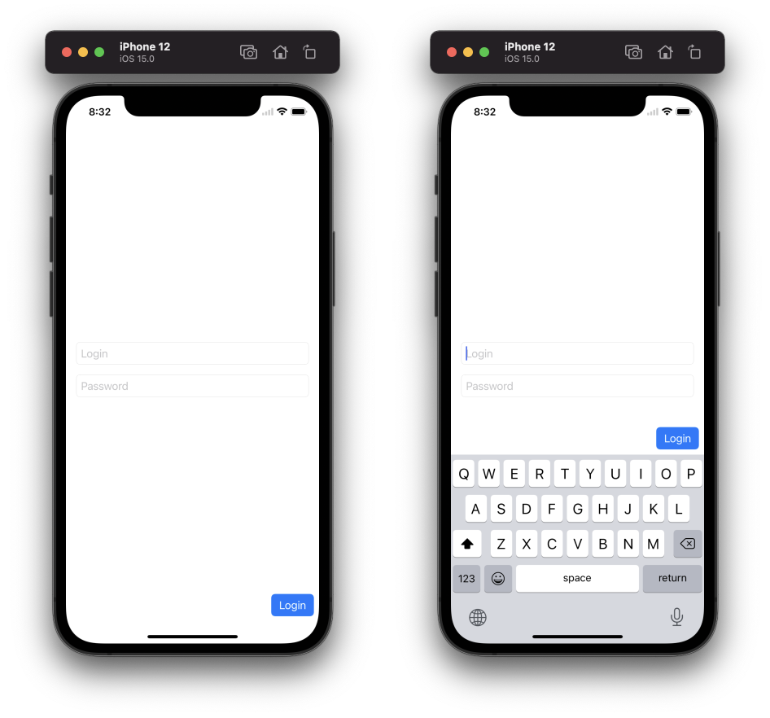

# UIKeyboardLayoutGuideExample
An example project for [Guide for UIKeyboardLayoutGuide](https://blog.artemnovichkov.com/keyboard-layout-guide) article.

>  Note: The project works in Xcode 13.0 beta (13A5154h).

  

## Author

Artem Novichkov, mail@artemnovichkov.com

## License

The project is available under the MIT license. See the [LICENSE](./LICENSE) file for more info.
